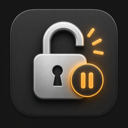

# LockHold



Keep your Mac's display awake with one menu bar toggle.

LockHold is a small native macOS utility that temporarily prevents idle display
sleep and the automatic lock that normally follows it. It has no accounts,
network connections, analytics, or third-party runtime dependencies.

## Usage

Click the lock icon in the menu bar:

| Action | Behaviour |
| --- | --- |
| **Disable Auto-Lock** | Keep the display awake. The icon becomes a red crossed-out lock. |
| **Enable Auto-Lock** | Release LockHold's override and return control to macOS. |
| **Exit** | Quit the app and release its override. |

The app starts with the override off. The choice is temporary and is not saved
between launches. LockHold does not change your stored power or password settings
and does not start automatically at login.

### What it prevents

LockHold holds an IOKit
[`PreventUserIdleDisplaySleep` assertion](https://developer.apple.com/documentation/iokit/kiopmassertiontypepreventuseridledisplaysleep).
This asks macOS to prevent idle display sleep. It is not a general switch for every
way a Mac can lock: manual locking, closing a laptop lid, forced sleep, and
organisation-managed policies remain outside its control. macOS may also override
power assertions under battery or thermal constraints.

**Enable Auto-Lock** only releases LockHold's own assertion. It does not enable a
disabled system lock setting or cancel assertions held by other apps.

## Build and run

Requirements:

- macOS 14 Sonoma or later, on Apple Silicon or Intel.
- Xcode 16 or later, with its command-line tools selected (`xcode-select -p`).
- Swift 6 or later. CI uses Xcode 16.4 to keep formatting consistent.

Download or clone this repository, then run from its root:

```sh
./script/build_and_run.sh
```

The script builds `dist/LockHold.app` and launches it. The app appears in the menu
bar, with no Dock icon or main window. The script can also be invoked by absolute
path from another directory, including paths containing spaces.

To build an optimised app without launching it or stopping a running instance:

```sh
./script/build_and_run.sh --build --release
```

You can copy the resulting app into Applications. These are local, ad-hoc-signed
builds for the build machine's architecture, not notarised public downloads.
See [release preparation](docs/RELEASING.md) before distributing binaries.

If your checkout is inside iCloud Drive or another synced folder, its file provider
may add Finder metadata that invalidates macOS bundle verification. Build into an
unsynced directory instead:

```sh
LOCKHOLD_DIST_DIR="$HOME/Library/Caches/LockHold/dist" ./script/build_and_run.sh --build --release
```

`LOCKHOLD_DIST_DIR` must be an absolute path and is also honoured by the launch modes.

### Development commands

| Command | Purpose |
| --- | --- |
| `./script/build_and_run.sh --build` | Build a debug app bundle without launching it. |
| `./script/build_and_run.sh --verify` | Rebuild, launch, and check that the process stays running. |
| `./script/build_and_run.sh --debug` | Rebuild and launch under LLDB. |
| `./script/build_and_run.sh --logs` | Rebuild, launch, and stream process logs. |
| `./script/build_and_run.sh --telemetry` | Rebuild, launch, and stream LockHold's local diagnostic logs. |
| `./script/build_and_run.sh --help` | Show all options. |

All modes except `--build` stop the current user's running LockHold process before
rebuilding. This releases any active override; the new instance starts with it off.
Build or signing failures leave the previous app bundle intact.

## Lint and tests

Install [ShellCheck](https://www.shellcheck.net/) once, then run the checks:

```sh
brew install shellcheck
./script/check.sh
```

This runs Swift's bundled `swift-format` linter in strict mode, ShellCheck,
shell syntax and bundle-metadata checks, Swift tests with compiler warnings treated
as errors, and build-script regression checks. Tests use a fake IOKit client and
do not change the Mac's sleep state.

```sh
./script/lint.sh        # Check Swift and shell code
./script/lint.sh --fix  # Format Swift, then rerun all lint checks
swift test             # Run just the Swift tests
```

GitHub Actions is configured to run the same checks and build release bundles on
Apple Silicon and Intel. No signing secrets are needed for these local-build checks.

## Contributing

See [CONTRIBUTING.md](CONTRIBUTING.md) for the code structure, development workflow,
and manual UI checks. For security concerns, see [SECURITY.md](SECURITY.md).
Notable changes are recorded in [CHANGELOG.md](CHANGELOG.md).

## Licence

LockHold uses the [BSD 2-Clause licence](LICENSE). You may use, modify, and
redistribute it, including commercially, provided you retain the copyright notice,
licence conditions, and disclaimer. The software is provided without warranty.
